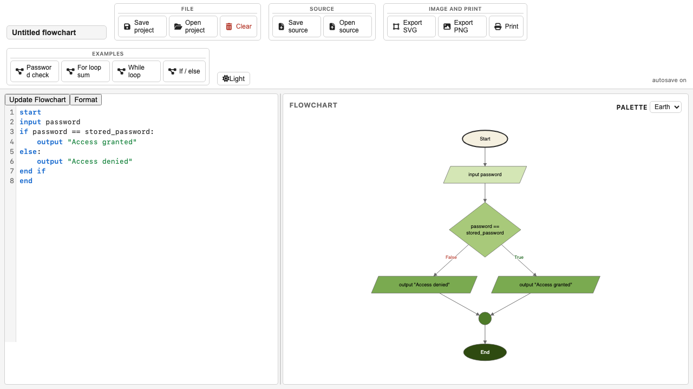
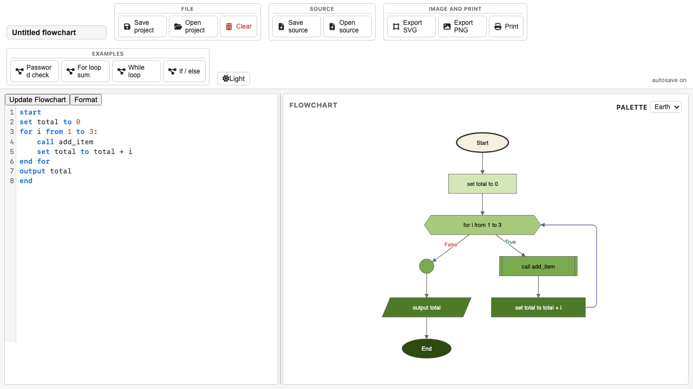

# Usage

How to run and use the pseudo-code flowchart editor.

## Running the app

Build and serve the app locally:

```bash
bash run_web_server.sh
```

This builds `dist/` and starts a Python HTTP server on a random port in the
8000-8999 range. Open the URL printed in the terminal. On macOS a browser tab
opens automatically.

To build without serving (for GitHub Pages or manual inspection):

```bash
bash build_github_pages.sh
```

## Editing pseudo-code

1. Type or paste pseudo-code in the left-pane editor. The grammar is defined in
   [PSEUDO_CODE_FORMAT.md](PSEUDO_CODE_FORMAT.md).
2. Click **Update Flowchart** in the toolbar (or press the assigned shortcut) to
   parse the source and render the flowchart diagram on the right.
3. Drag nodes to adjust positions. Drag the background to pan the canvas.
   Double-click the background to reset the view. Manual node positions are
   remembered until the document is cleared.

## Saving and loading work

The app autosaves to `localStorage` on every source change (500 ms debounce). Work
persists across page reloads automatically.

For explicit file-based save/load:

- **Save project** - writes a `.json` FlowDocument file.
- **Open project** - reads a `.json` FlowDocument file and replaces the current
  document.
- **Save source** - writes the raw pseudo-code text as a `.pseudo` file.
- **Open source** - reads a `.pseudo` file into the editor.

See [FILE_FORMATS.md](FILE_FORMATS.md) for the file format details.

## Templates

The toolbar includes an **Examples** group with prefilled pseudo-code programs.
Click any button to load that program; if the current document has content you
will be asked to confirm before the existing work is replaced. The same buttons
appear in the empty-state panel shown when the document source is empty.





## Exporting the flowchart

The toolbar provides:

- **Save SVG** - vector export (pan/zoom transform stripped; always light-mode
  colors).
- **Save PNG** - rasterized export (capped at 8000 px on the long side).
- **Print** - opens the browser print dialog.

## Developer checks

Run the full TypeScript gate (typecheck, ESLint, Prettier, node unit tests):

```bash
bash check_codebase.sh
```

Run browser-driven Playwright tests:

```bash
bash run_playwright_tests.sh
```

Run Python hygiene tests (whitespace, ASCII, markdown links, shebangs):

```bash
pytest tests/
```
